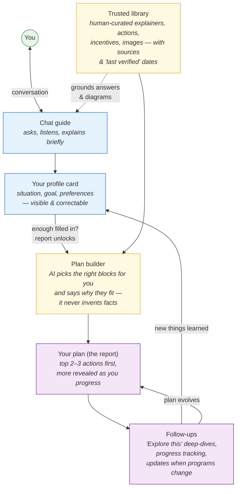

# Where Clean Start is headed — a plain-language overview

*(For the full technical design, see
[design-personalization-architecture.md](design-personalization-architecture.md).)*

## What changes for the user

Today, Clean Start is a chat that ends in a one-off report. The new
design turns it into a **guide that gets to know you, draws on a
trusted library, and helps you make real progress over time**. Six
ideas, working together:

### 1. A profile card that fills in as you talk

As the conversation goes, the app quietly builds a card of what it has
learned: where you live (just your state — never your address), whether
you rent or own, what kind of home you have, and what you care about
most. The card is shown in a sidebar, **and you can correct it** — if
the app misunderstood, one click fixes it. When enough of the card is
filled in, the report unlocks. No more arbitrary "answer three
questions first."

### 2. One main goal shapes everything

People come to clean energy for different reasons: lower bills, climate
impact, a more comfortable home, backup power when the grid fails — or
just to learn. The app figures out which of these matters most to you
(and it's fine to care about more than one), then orders its questions,
its answers, and your report around *your* reason. Someone chasing
lower bills sees quick money-savers first; someone worried about
outages sees backup options first — built from the same trusted
material.

### 3. A trusted library instead of AI improvisation

The biggest trust change: **the AI no longer writes the facts.** A
curated, human-reviewed library holds the building blocks — explainers,
recommended actions, incentive programs, diagrams and images — each
tagged by region and housing type, each with sources and a
"last verified" date. The AI's job is to *pick* the right blocks for
you and explain *why they fit your situation*. It cannot recommend
anything that isn't in the library, and every report shows its sources.

While the library is still growing, some report entries may be
AI-written where no reviewed block exists yet — those are clearly
labeled as such, never dressed up as reviewed content, and each one
tells the team exactly what to add to the library next. As the
library fills in, they disappear.

### 4. A short plan that grows — not an overwhelming checklist

Your report starts with just your top two or three actions. The rest
are held back and revealed as you make progress, so you're never
staring at a wall of prerequisites. Each action on your plan has an
"Explore this" button that starts a focused follow-up conversation —
the app remembers your report and digs deeper into that one step, and
what it learns updates your plan in place.

### 5. The report is a beginning, not a receipt

For signed-in users, the plan stays alive. When you come back, you see
where you left off. If a rebate program behind one of your actions
changes or is about to expire, the app can tell you — because it knows
exactly which library blocks your plan was built from. (Email reminders
come later, and only if you opt in.)

### 6. An easy way in, and easy ways to answer

Starting stays as simple as it is today: two quick questions up front
(rent or own, and your zip — because the very first answer would be
wrong without them), then a set of one-tap starting points like
"Lower my energy bills" or "Is solar worth it?". These starting
points now do more than send a message — picking one tells the app
what you care about, so the conversation starts smart instead of
spending its first minutes rediscovering why you came. And when the
guide asks a question during the chat, common answers appear as
tappable buttons — tap one or just type your own answer, whichever is
faster. Returning users don't repeat the setup: their saved basics
appear pre-filled, with one tap to confirm or change.

**Guests get almost all of this** — the profile card, the personalized
plan — saved only in their own browser, with nothing stored on our
servers. Signing up is what makes the plan permanent and unlocks
updates and reminders.

## How the pieces fit

*(GitHub renders this diagram automatically when viewing the file.)*

## Why this order of work

1. **The profile card** comes first — everything else depends on it.
2. **Goal-based guidance** (the "lanes") builds directly on the card.
3. **The trusted library and block-built reports** — the trust layer.
4. **The living plan and follow-ups** — the long-term engagement layer.

## The principles behind it

- **The AI picks and personalizes; humans curate the facts.** Every
  recommendation traces back to a reviewed library block with sources.
- **Show your work.** The profile card and the report's "about you"
  section show exactly what the advice was based on — and let the user
  fix it.
- **Remember "no" as well as "yes."** If someone rules out solar
  because of a shaded roof, the app stops suggesting it — in this
  session and the next.
- **Never overwhelm.** A few right next steps now beat a complete
  checklist that gets ignored.
- **Privacy by default.** Location stays coarse (state-level), guest
  data never touches our servers, and reminders are strictly opt-in.
